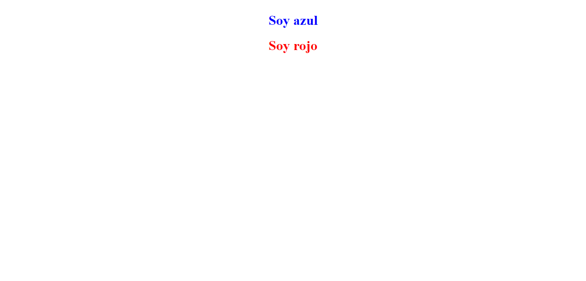
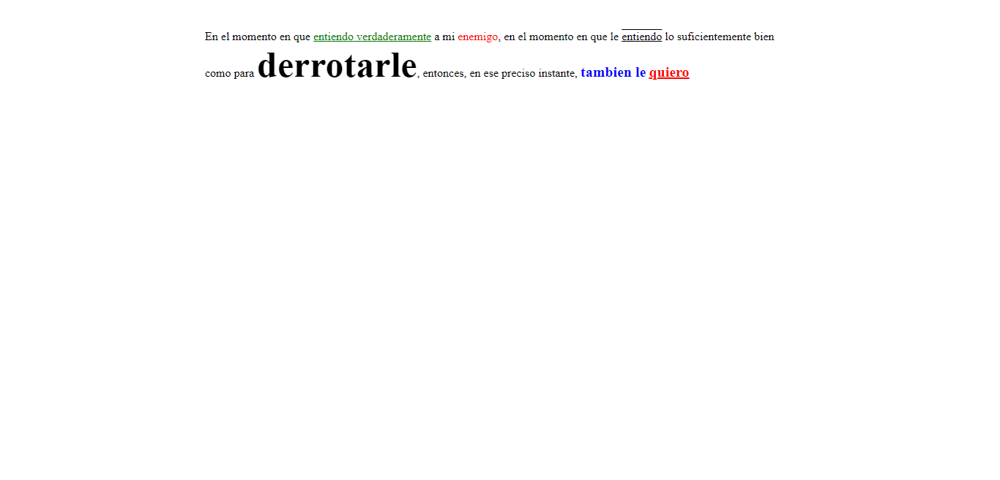
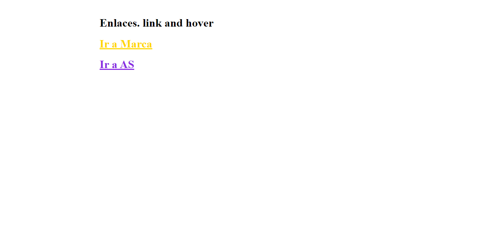
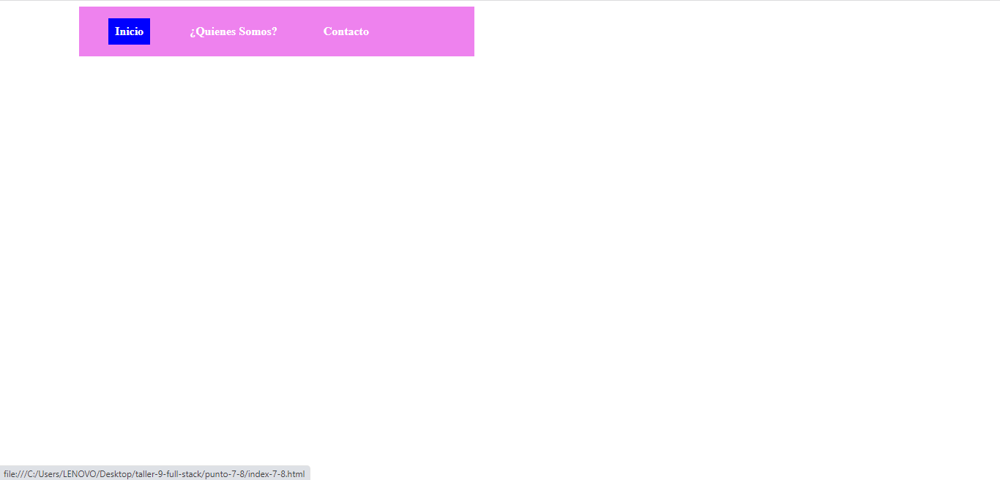
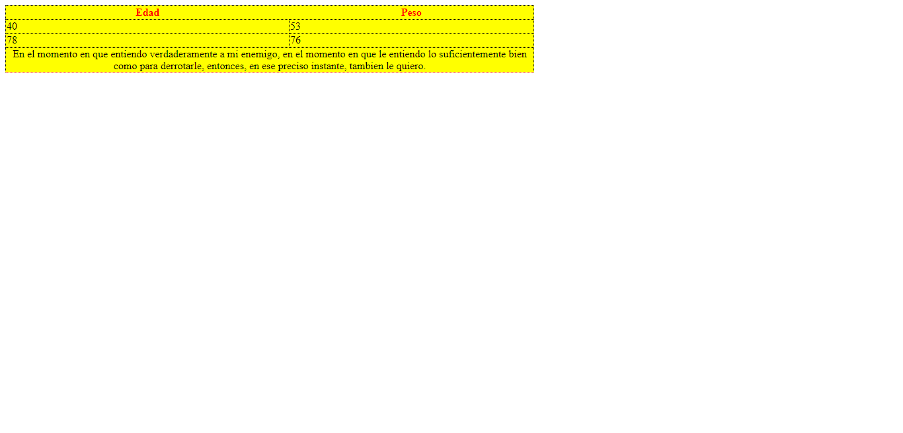

<h1>Taller 9 Jhon Edier Gonzalez Urrego</h1>

<h2> Información</h2>

Curso: full Stack Basico - Grupo 1

Profesor: Cristian Patiño

<h3>Link Pagina Web</h3>
<a href="https://jhong2002.github.io/taller-9-full-stack/" target="_blank">Link pagina web</a>

<h2> Punto 1: Link figma</h2>

<a href="https://www.figma.com/file/kfGZwL9ZwtHzS011H2KXf0/jhon-Gonzalez---Figma-Excesice?type=design&node-id=0%3A1&mode=design&t=NRw1xPmHaHStW62Z-1" target="_blank">Link de Figma</a>

<h2>Punto 2: HTML</h2>
 

<h2>Punto 3: CSS</h2>
 

<h2>Punto 4: TITULOS</h2>
 

<h2>Punto 5: ESTILOS DE TEXTO</h2>

 
<h2>Punto 6: ENLACES</h2>

<h2>Punto 7-8: NAVEGACION</h2>

<h2>Punto 9: TABLAS</h2>
