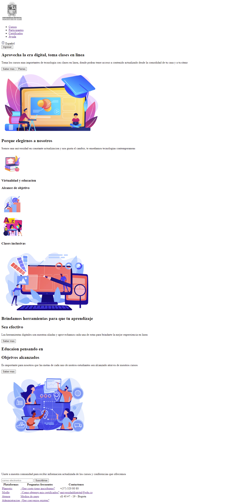

<h1>Taller 9 Jhon Edier Gonzalez Urrego</h1>

<h2> Información</h2>

Curso: full Stack Basico - Grupo 1

Profesor: Cristian Patiño

<h2> Punto 1: Link figma</h2>

<a href="https://www.figma.com/file/kfGZwL9ZwtHzS011H2KXf0/jhon-Gonzalez---Figma-Excesice?type=design&node-id=0%3A1&mode=design&t=NRw1xPmHaHStW62Z-1" target="_blank">Link de Figma</a>

<h2>Punto 2: HTML</h2>
 